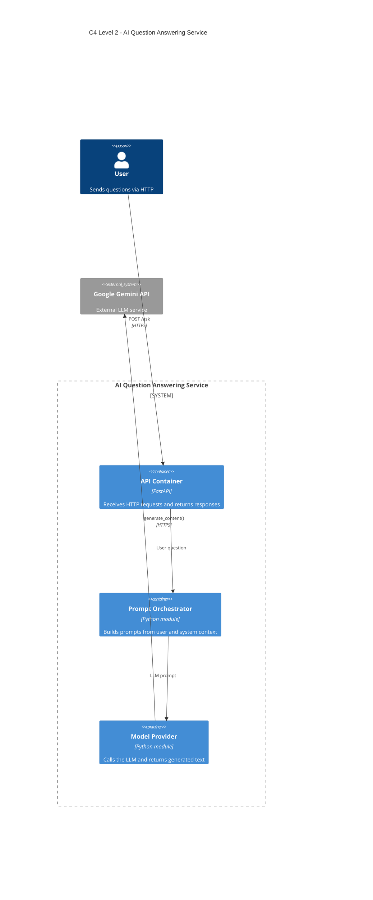

# AI Question Answering Service

## Architecture

```mermaid
%%{init: {"c4": {"c4ShapeMargin": 110, "c4ShapeInRow": 3}}}%%
C4Container
    title C4 Level 2 - AI Question Answering Service

    Person(user, "User", "Sends questions via HTTP")
    System_Ext(genai, "Google Gemini API", "External LLM service")

    System_Boundary(system, "AI Question Answering Service") {
        Container(main, "API Container", "FastAPI", "Receives HTTP requests and returns responses")
        Container(orchestrator, "Prompt Orchestrator", "Python module", "Builds prompts from user and system context")
        Container(model_provider, "Model Provider", "Python module", "Calls the LLM and returns generated text")
    }

    Rel(user, main, "POST /ask", "HTTPS")
    Rel(main, orchestrator, "User question")
    Rel(orchestrator, model_provider, "LLM prompt")
    Rel(model_provider, genai, "generate_content()", "HTTPS")

    UpdateRelStyle(user, main, $offsetX="-45", $offsetY="-30")
    UpdateRelStyle(main, orchestrator, $offsetX="-40", $offsetY="-10")
    UpdateRelStyle(orchestrator, model_provider, $offsetX="-45", $offsetY="-10")
    UpdateRelStyle(model_provider, genai, $offsetX="10")
```

